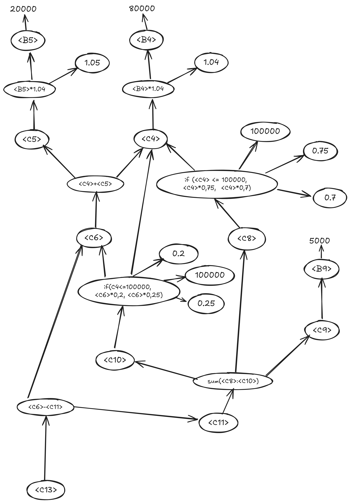

# Hello 😀
Thanks for the exercise, there are few assumptions about the algorithm that'll explain below, if you have any doubts feel free to contact me through my email <u>wilton.leonardo@hotmail.com</u>. 

## 1. What is the problem
Finance teams at companies create financial projections based on assumptions about their business. Excel is the most widely used tool for this purpose, but it's too handy make an spreadsheet everytime something has changed and it's difficult to maintain and determine which spreadsheet is the latest one, which it can easily mislead decisions. The goal is to extract relations between cells from a financial projection data in a Excel file to create a graph structure with a token list that allows easy manipulation and scenario analysis, besides that should work with any spreadsheet, providing a well-formed structured data that can enable an frontend implementation to get projections and it can easily be changed by user.

## 2. Approaches
I had two approaches when I was thinking about it, one it's if I can get the projection cells formula (which is usually common in spreadsheet libraries for tons of programming languages) or if i cannot get it. Despite that, both approaches will follow something like a lexical and syntactic analysis, commonly used in a lot of programming languages compilers to verify inconsistencies in code write.

### 2.1 If we can get projections cells formula through library
Given the rows and columns, we must identify which type is (text, numeric) and tokenize that into a table that represents all valued cells (empty cells will be not have a token). Below it's a example for August projection tokens:
|**Token**|**Type**|**Value**|
|-|-|-|
|\<B4>|Numeric|80000|
|\<B5>|Numeric|20000|
|\<C4>|Numeric|\<B4>+1.04|
|\<C5>|Numeric|\<B5>+1.05|
|\<C6>|Numeric|\<C4>+\<C5>|
|\<C8>|Numeric|if (\<C4> <= 100000, \<C4>*0,75,  \<C4>*0,7)|
|\<C9>|Numeric|\<B9>|
|\<C10>|Numeric|if(\<C4><=100000, \<C6>*0,2, \<C6>*0,25)|
|\<C11>|Numeric|sum(\<C8>:\<C10>)|
|\<C13>|Numeric|\<C6>-\<C11>|

If the cells contains a formula, and that formula it's a format it's like a cell (B6, C6, for example) in that formula we must change the cell to its associated token.
\
\
**Note:** We will still have to parse excel formulas (how process sum, how to process an if, or any other formula) to get node calculation right some kind of from-to that how text will come and how we evaluate that node.
\
\
Using the tokens and formulas we can generate a dependency graph for the spreadsheet itself, where the nodes are the token values, in that way, every node token that contains a formula must depends of one or multiple nodes needed for that evaluation must be connected with a edge. Below it's a example for August projection tokens processed in dependency graph:
\

After the processing, we will have a dependency graph that contains decomposed formulas and current value nodes. If we want to know the values  of projections we could just look to the nodes values, if we change any node value all nodes that depends on that node must be recalculated through the formulas, if we want to change the formula itself we could just change the edge and recalculate the nodes.
\
### 2.2 If we cannot get projections cells formula
We must find out and separate each type of cell content, if a numeric value, text value, or any other type that we want to differentiate, for example, period in format month/year, we will need this to check if next cell is a value of the current grouping or a new one.
\
\
If we cannot get formulas it's necessary create some logic do define groupings cells, for example, given a column, if top-most cell value it's a text we can get as a header, some all values below that cell are part of that column grouping, working in similar way for row header based, left-most cell value has a text, all cells at the right of that cell are part of the row grouping.
\
\
After that we need to find out which formula it was used based on cell numeric value, we could use something similar as described below, but it's turns too complex and expensive computationally do a lot of calculation to discover fractions and expressions of each formula.
\
\
If we can find out the formulas we can create token list and dependency graph and the resolution at that point will be the same as 2.1.

## 3. Conclusion
It's possible to do some otimization in data structures (relation graph and token list) doing some simplifying in tokens and formulas, in that way we don't need to get all graph along to determine node values.
\
\
This structure can be used with any type of spreadsheet, since we had how to determine the spreadsheet formula through a library, if not, it would be too computer expensive to do all calculation to discover formulas every single time.
\
\
That output can easily be formatted as input needed (which it's the tokens needed to create the projection) and after the user provide the inputs we can generate a second graph identical to the first one in terms of structure but with values calculated correctly and easily compare the projection and the real one, or even create some historical data which multiples graphs. 
\
\
We can provide a more readable name of the token for user doing some assumptions, for example if the first data of the column it's a text and all the rows below are numeric we can assume the first row as a header, or in similar way if most-left column has a text and all the columns after are numeric, we could assume the first column as header.
At the end, we can save this spreadsheet structure (graph and token list) in a database and still retrieve those data after to project budgets, in a frontend view or even if user wants it, generate and export it as a new spreadsheet.  

